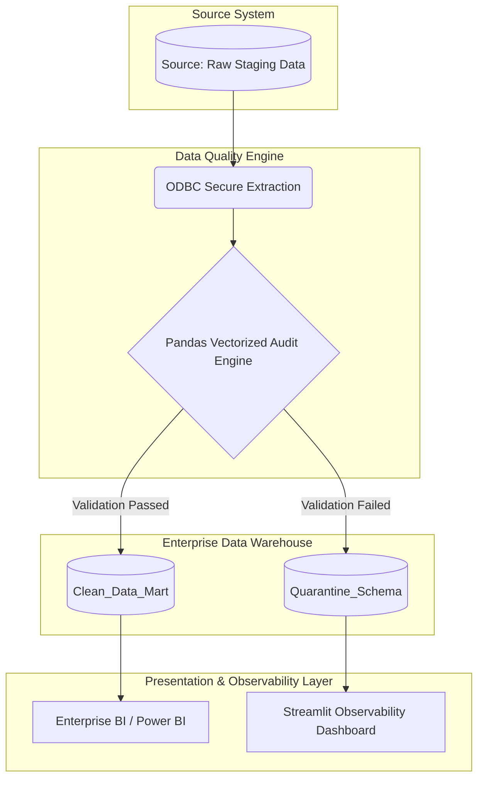

# Automated Data Quality & Governance Pipeline

> **Enterprise-Grade Data Integrity Engine: Protecting the 'Single Source of Truth' through automated auditing, vectorized rule processing, and physical isolation of anomalous data.**


---

## 1. **EXECUTIVE SUMMARY & BUSINESS CONTEXT**

In modern enterprise data ecosystems, the integrity of the semantic layer is paramount. "Silent data degradation"—characterized by orphaned foreign keys, negative quantities, syntax formatting errors, and anomalous metrics in raw staging tables—can seamlessly corrupt downstream Business Intelligence (BI) reporting. When C-level executives and key stakeholders consume dashboards built on flawed data, it leads to inaccurate forecasting, compliance breaches, and ultimately, poor strategic decision-making.

This project implements a robust, automated End-to-End (E2E) ETL and Data Quality (DQ) pipeline designed to proactively scan, isolate, and log anomalies in SQL Server databases before they ever reach production Data Marts. Acting as an automated data gatekeeper, it shifts the data validation process "to the left" (validating strictly at the ingestion phase), ensuring a pristine Single Source of Truth for corporate analytics.

---

## 2. **STRATEGIC IMPACT & OPERATIONAL ROI**

The implementation of this architecture replaces reactive, manual data cleaning workflows with a proactive data engineering solution, generating immediate and measurable business value:

* **Zero Data Contamination:** Establishes a strict programmatic firewall that prevents orphaned records or corrupted transactional data from contaminating upstream management reports.
* **Physical Data Isolation (The Quarantine Strategy):** Automatically partitions validated data from anomalies into strictly separated database tables (e.g., `dbo.VentasLimpias` and `dbo.VentasBasura`). This allows Data Stewards to investigate and remediate errors at their source without bottlenecking the main business workflow.
* **SLA Fulfillment & Automation:** Reduces manual data auditing workflows by over 95%. By automating the extraction and validation phases, the system ensures that data availability Service Level Agreements (SLAs) are consistently met for downstream analytics teams.
* **Governance & Traceability:** Provides stakeholders with a comprehensive, BI-like observability interface to audit the database's Health Score dynamically, creating a traceable and immutable audit log required for internal compliance and regulatory standards.

---

## 3. **END-TO-END PIPELINE ARCHITECTURE**

The system is designed following the foundational principles of a Medallion Architecture (Bronze to Silver zone logic) adapted specifically for relational staging environments.


---

#### **3.1. Architecture Phase Breakdown**

1. **Ingestion & Extraction (E):** Secure connection to the SQL Server instance via pyodbc to extract massive batches from the source table.

2. **Transformation & Auditing (T):** Intensive use of Pandas to apply high-performance vectorized validations, completely avoiding inefficient loops.

3. **Loading & Synchronization (L):** Integration with SQLAlchemy to index the results back to the SQL server, automatically recreating the clean and quarantine tables in a transactional manner.

4. **Presentation Layer:** Deployment of an interactive web application built with Streamlit featuring native Plotly visualizations for data observability.

## 4. **CORE ENGINEERING PRINCIPLES & OPTIMIZATIONS**

   #### **4.1. High-Performance Vectorized Validation Engine**
   Traditional iterative data processing algorithms (for or while loops) iterating over large datasets cause severe memory bottlenecks and unacceptable latency. This pipeline is optimized entirely using Pandas boolean masking and vectorized operations. By applying mathematical and logical validations across entire columns simultaneously in memory, the engine evaluates thousands of records against multiple complex rulesets in milliseconds.

   #### **4.2. Transactional Safety & ORM Integration** 
   Database operations are not handled via fragile raw string query execution. The pipeline utilizes the SQLAlchemy Object-Relational Mapper (ORM) combined with the pyodbc driver. This implementation ensures:

      * Intelligent connection pooling and resource optimization.

      * Atomic batch writing (preventing partial data loads and data corruption during network failures).

      * Robust deadlock prevention and advanced timeout management when interfacing with the SQL Server instance under
      heavy load.

   #### **4.3. Real-Time Data Observability & Monitoring**
   A built-in Streamlit frontend acts as the Data Quality Control Center. It abstracts the underlying SQL and Python backend complexity, providing real-time monitoring of Data Quality Key Performance Indicators (KPIs), visual distribution of error typologies, and secure data extraction modules for external auditing and reporting.

## 5. **DETAILED DATA QUALITY RULES ENGINE**
The engine evaluates all incoming transactional records against a strict, multi-layered set of business and logical rules:

   1. **Relational & Completeness Integrity:** Scans for null values, NaNs, or empty strings in critical categorical dimensions (e.g., missing Product IDs, empty client names) to definitively prevent orphaned records in the Data Warehouse Star Schemas.

   2. **Mathematical Boundary Checks:** Enforces absolute logical consistency on quantitative fields (e.g., ensuring Quantity > 0 and Unit_Price >= 0.00). Transactions violating these financial boundaries are instantly flagged.

   3. **Syntax & Pattern Recognition:** Utilizes highly optimized Regular Expressions (Regex) to validate string formats. For instance, ensuring that all Email fields conform strictly to standard RFC 5322 email address patterns, discarding malformed or dummy strings.

## 6. **COMPREHENSIVE TECHNOLOGY STACK & RATIONALE**

   * **Database Engine:** SQL Server (Transact-SQL). Chosen for its enterprise ubiquity, strict ACID compliance, and seamless integration with corporate Active Directory security policies.

   * **Core Processing Engine:** Python 3.9+. Selected as the industry standard for advanced data engineering and data manipulation tasks.

   * **Data Manipulation Framework:** Pandas. Chosen over distributed frameworks (like Apache Spark) because the current volume threshold and single-node batch processing requirements are perfectly optimized through vectorization, actively avoiding unnecessary cluster maintenance overhead.

   * **Connectivity & Middleware:** PyODBC & SQLAlchemy. The industry gold standard for secure, reliable, and efficient relational database connectivity.

   * **Observability UI:** Streamlit & Plotly Express. Allows for the rapid deployment of a data-driven web application with interactive charting, eliminating the need to maintain a separate React/Node.js stack.   

## 7. **SCALABILITY & CLOUD MIGRATION ROADMAP**
While this repository demonstrates a highly optimized local architecture, the codebase is structurally prepared for seamless migration to enterprise cloud environments:

* **Compute Layer:*** The Python processing engine can be natively containerized using Docker and orchestrated via Kubernetes (AKS/EKS) or executed as serverless functions (AWS Lambda / Azure Functions) for infinite horizontal scaling.

* **Storage Layer:** The SQL Server instance can be seamlessly migrated to Azure SQL Database or Amazon RDS without changing the core SQLAlchemy dialects.

* **Workflow Orchestration:** The ETL execution, currently triggered manually via scripts, is structurally designed to be wrapped into Directed Acyclic Graphs (DAGs) and scheduled using Apache Airflow or Azure Data Factory.

## 8. **DEPLOYMENT, SETUP, AND REPRODUCTION GUIDE**
Follow these technical runbook steps to provision the local environment, configure the database schemas, and execute the full pipeline.

##### **Phase 1: Database Provisioning and Initialization**
1. Connect to your target SQL Server instance (e.g., LocalDB, SQLEXPRESS, or Developer Edition) using SQL Server Management Studio (SSMS) or Azure Data Studio.

2. Execute the provided SQL provisioning script (sql/portafolioDB.sql) to create the PortafolioDB database, staging tables, and necessary schema configurations.

3. Verify the successful creation of the target staging table [dbo].[VentasCrudas].

##### **Phase 2: Virtual Environment Configuration**
1. Open a terminal instance in the project's root directory and initialize an isolated Python virtual environment to avoid dependency conflicts:

```
python -m venv venv
```

2. Activate the virtual environment:

* Windows Environment: venv\Scripts\activate

* Mac/Linux Environment: source venv/bin/activate

3. Install the required engineering and data science dependencies via the package manager:

```
pip install -r requirements.txt
```

##### **Phase 3: Pipeline Execution and Verification**
1. Generate Synthetic Staging Data: Run the generator script to populate the raw database table with a controlled, randomized mix of clean and intentionally corrupted records for testing purposes.

```
python src/generador_datos.py
```

2. Execute the Core ETL & Audit Engine: Run the primary backend processing script. The engine will ingest the raw data, apply the vectorized validation rules, print the operational logs, and output the physical results to the VentasLimpias and VentasBasura tables in the SQL Server instance.

```
python src/main.py
```

3. Launch the Observability Interface: Start the Streamlit frontend server to visualize the data health metrics, explore the interactive charts, and interact with the quarantine results.

```
streamlit run src/app.py
```
(The dashboard will automatically deploy and become accessible on your localhost, typically via port 8501).

## 9. SECURITY, COMPLIANCE, AND INFRASTRUCTURE DISCLAIMER
Database connection strings, target server definitions, port configurations, and structural parameters are hardcoded within the source files strictly for local demonstration and portfolio evaluation purposes.

Production Environment Warning: In a live, production-grade enterprise environment, this codebase requires the complete abstraction of all credentials, endpoints, and database secrets. These parameters must be dynamically injected during runtime via secure Environment Variables (.env), AWS Secrets Manager, or Azure Key Vault to strictly comply with standard Information Security (InfoSec) protocols and ISO 27001 guidelines.